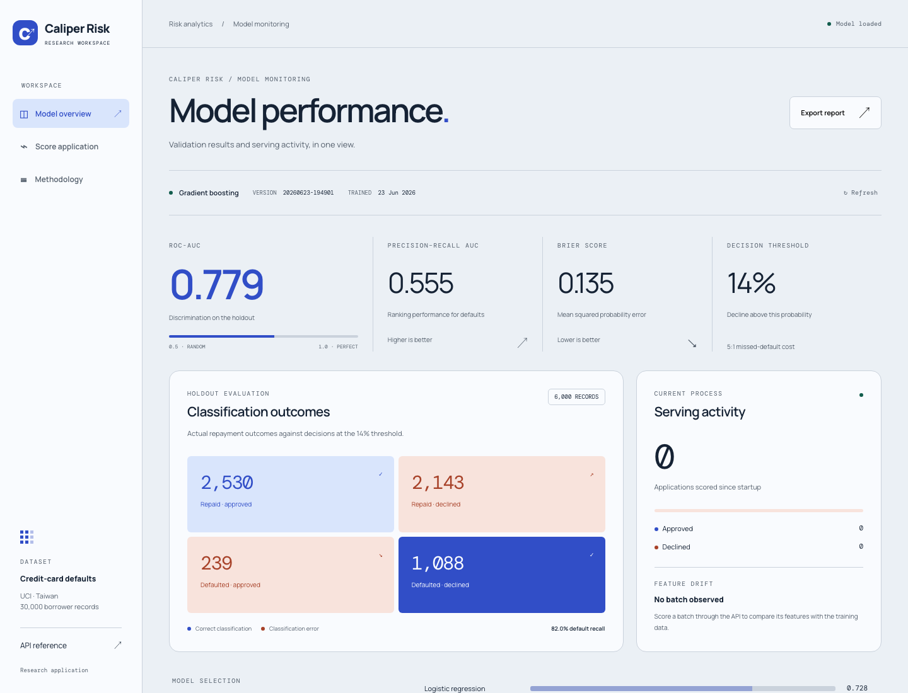

# Caliper Risk

**Risk methodology and model monitoring.**

Train, serve and review a credit-default model built on the UCI Taiwan credit-card dataset.
The browser dashboard shows saved validation results, current-process scoring counts and
feature drift from the latest scored batch. It also supports single-application scoring
and JSON report export.



## Project ownership

[Abhay (@immortal-coder-abhay)](https://github.com/immortal-coder-abhay) owns this project.

## Run

```bash
uv sync --frozen --extra dev
uv run credit-scoring serve --host 127.0.0.1 --port 8520
```

Open **http://127.0.0.1:8520**. API documentation is at `/docs`.
A registered model and its training reference are included. To train a new version:

```bash
uv run credit-scoring train
```

Alternatively, use `docker compose up --build` to run the API on port 8000,
Prometheus on 9090 and Grafana on 3000. The dashboard is served by the API at `/`.

## Recorded validation

The included model is gradient boosting with isotonic probability calibration.
Metrics below come from `artifacts/registry/20260623-194901/metadata.json`.

| Metric | Value |
|---|---:|
| Holdout records | 6,000 |
| ROC-AUC | 0.7789 |
| Precision–recall AUC | 0.5546 |
| Brier score | 0.1352 |
| Decision threshold | 0.14 |
| Default recall at threshold | 0.8199 |

The threshold uses an assumed 5:1 cost ratio between a missed default and a declined
repaying borrower. The confusion counts are 2,530 true negatives, 2,143 false positives,
239 false negatives and 1,088 true positives. See the [model card](MODEL_CARD.md)
for the data, evaluation and limitations. Threshold selection uses the same holdout,
so the policy metrics are retrospective rather than an independent policy evaluation.

## Dashboard

- **Model overview:** validation metrics, classification outcomes and cross-validation scores.
- **Serving activity:** actual scoring counts since the current process started. These are
  not historical portfolio totals and reset on process restart.
- **Feature drift:** population stability index (PSI) from the latest batch. Until a batch
  is scored, the dashboard displays “No batch observed.”
- **Score application:** an editable example with all 23 input fields. Amounts are in New
  Taiwan dollars. Results use the loaded model and its stored threshold.
- **Export report:** downloads the displayed model metadata and serving snapshot as JSON.

Fonts are bundled locally. The interface supports keyboard navigation, narrow screens
and reduced motion.

## API

| Method | Path | Response |
|---|---|---|
| GET | `/` | Dashboard |
| GET | `/dashboard/data` | Model metadata, scoring counts and latest feature PSI |
| POST | `/predict` | One default probability and decision |
| POST | `/predict/batch` | Up to 1,000 predictions and a drift warning |
| GET | `/model/info` | Model version, algorithm, threshold and metrics |
| GET | `/health` | Process health and model loading status |
| GET | `/metrics` | Prometheus metrics |

## Checks

```bash
uv run pytest
uv run ruff check src tests
```

Tests use a temporary model trained on synthetic data and do not download the dataset.
The application code is under `src/credit_scoring`; browser assets are under
`src/credit_scoring/serving/static`. See [Architecture](ARCHITECTURE.md) for the
training and serving paths.
